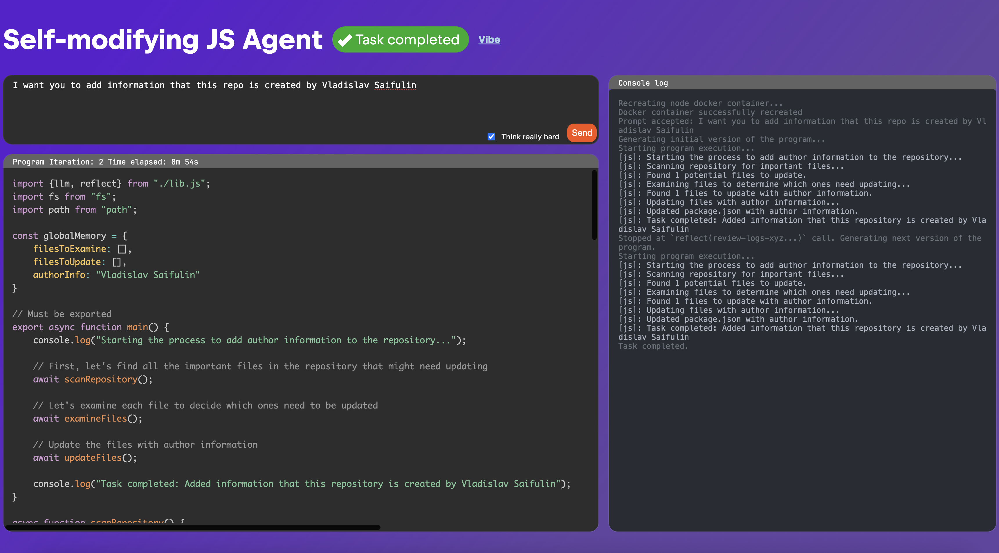

# Self-modifying JS Agent



An AI agent that writes own code in JavaScript, executes it in a docker container and 
reflects on its own mistakes, decisions and runtime errors adjusting own code.

# Prerequisites

`docker` and `java` must be installed.
`GRAZIE_TOKEN` env should point to your grazie token on staging platform.

# How to run:
```
git clone git@github.com:Recognized/self-modifying-agent.git
cd self-modifying-agent
java -jar agent/libs/agent-all.jar
```

And just open http://localhost:2205 and type your prompt
